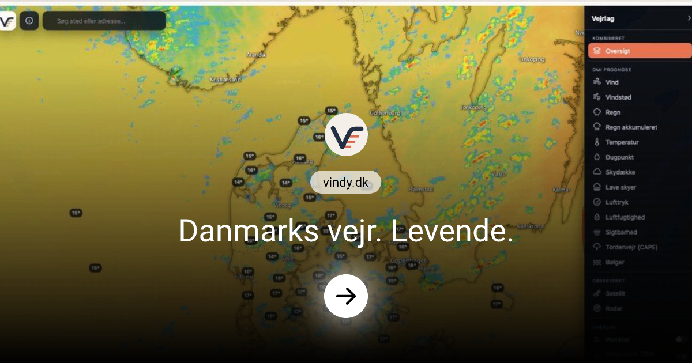

# Vindy — Danmarks vejr. Levende.

An interactive weather map for Denmark, built only on official DMI forecasts.
Live at **[vindy.dk](https://vindy.dk)**.



Weather maps like Windy, Ventusky and Zoom Earth are lovely to use, but none of them show
DMI's model — the one Denmark's own forecasts are based on. Vindy does: every forecast
layer comes from DMI's HARMONIE model at 2 km detail over Denmark, updated every three
hours and reaching 60 hours ahead. Radar and satellite imagery come from EUMETNET and
EUMETSAT. It is a private, non-commercial hobby project.

## Features

- **Forecast layers:** wind, gusts, rain, accumulated rain, temperature, dew point, cloud
  cover, low clouds, pressure, humidity, visibility, thunderstorms (CAPE) and waves
- **Oversigt:** temperature with radar on top, continuing with the rain forecast for hours
  the radar doesn't reach
- **Observations:** European radar composite and satellite imagery for the last 3 hours,
  plus live measurements from DMI's stations
- **Overlays:** animated wind and wave particles, isobars with highs and lows, automatically
  derived weather fronts, forecast values at towns, and a value grid
- **Point forecast:** click anywhere for an hour-by-hour meteogram, including the chance of
  rain from DMI's ensemble and waves at sea
- **Export:** save the map as an image (PNG) or as an animation (MP4 or GIF) over a
  period you choose
- **Progressice Web App:** works offline for the interface, with shortcuts to radar, wind and rain
- **Search** for Danish places and addresses, and shareable links like `/wind/55.68,12.57,9`
- Danish interface, dark map, no accounts and no ads

## Quickstart

With Docker, which is the recommended way to run it on a server:

```bash
docker compose up -d --build
```

Then open <http://localhost:5173>. No API keys or accounts are needed: the server fetches
everything from the open data sources itself. The first start takes about 30 seconds while
it indexes the newest model run; after that, data is cached on disk (about 350 MB).

Useful settings: `PORT` and `CACHE_DIR` when running locally, and `PREFETCH` in
`docker-compose.yml` to control how much of each model run is prepared in advance.
For HTTPS and a domain, put a reverse proxy such as Caddy in front.

## Contributing

Feature requests, bug reports and ideas are very welcome: please open an
[issue on GitHub](https://github.com/geofaredk/vindy/issues). Pull requests are welcome
too — for larger changes, open an issue first so we can talk it through.

## Data and credits

- Weather data © [DMI](https://www.dmi.dk/friedata) ([terms for DMI's open data](https://www.dmi.dk/friedata/dokumentation/terms-of-use))
- Radar © [EUMETNET OPERA](https://www.eumetnet.eu/activities/observations-programme/current-activities/opera/) via Open Radar Data (CC BY 4.0)
- Satellite imagery © [EUMETSAT](https://view.eumetsat.int) (EUMETView, MTG-I FCI True Colour RGB)
- Basemap © Esri, HERE, Garmin, © OpenStreetMap contributors
- Coastlines and borders: [GSHHG](https://www.soest.hawaii.edu/pwessel/gshhg/) (Wessel & Smith, NOAA/SOEST) and [Dataforsyningen](https://dataforsyningen.dk) (DAGI)
- Place and address search: Dataforsyningen and [Photon](https://photon.komoot.io) (OpenStreetMap, ODbL)
- Map rendering: [Leaflet](https://leafletjs.com)

Vindy is not affiliated with DMI, EUMETNET or EUMETSAT. Don't use it as your only basis for
safety-critical decisions.
